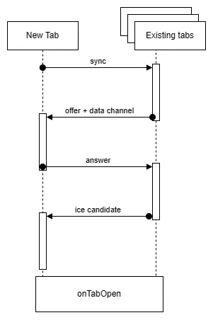

# Browser Tab Communication

[](https://github.com/kramer2005/express-async-error-handler/blob/master/LICENSE)
[](https://www.npmjs.com/package/@kramerdev/express-async-error-handler)

## Table of Contents
[About](#about)
- [Communication](#communication)
[Setup](#setup)
[Utilization](#utilization)
- [TabsManager](#tabsmanager)
- [BrowserTab](#browsertab)

## About

This project aims to utilize WebRTC for browser tab communication. The main objective is to have real time updates working with multiple tabs and windows.

### Communication

The connection is done through a broadcast channel. The main idea is inspired by the [Three-Way Handshake](https://en.wikipedia.org/wiki/Transmission_Control_Protocol#Connection_establishment) protocol, but with one more steps.

The process is as follows:

1. A new tab is opened and and sends a sync message to the broadcast channel (equivalent to syn).
2. The existing tabs receive the sync message, creates a data channel and send a offer message to the new tab (equivalent to syn+ack)
3. The new tab receives the offer message, connects to the data channel and sends a answer message to the existing tabs (equivalent to ack)
4. The tabs exchange ice candidates, the connection is established and all tabs execute the `onTabOpen` callback
5. After that, the tabs are represented through the [`BrowserTab`](#browsertab) class and can send and receive messages through the data channel



## Setup

The package is available on npm, soon to be published as a bundle in a CDN.

To install the package, run the following command:

```bash
npm install @kramerdev/browser-tab-communication
```

or with yarn:

```bash
yarn add @kramerdev/browser-tab-communication
```

## Utilization

The package exports two classes: `TabsManager` (with is exported as a singleton) and `BrowserTab`.

To use the package, you just need to import the TabsManager instance from the package and setup the callbacks for the `onTabOpen` and `onTabClose` events.

Example:

```typescript
import { TabsManager, BrowserTab } from '@kramerdev/browser-tab-communication';

TabsManager.onTabOpen = (tab: BrowserTab) => {
  console.log('Tab opened', tab);

  tab.onMessage = (message: string) => {
    console.log(`Tab ${tab.id} sent: ${message}`);
  };

  tab.send(`Hello, tab ${tab.id}`);
};
```

### TabsManager

The `TabsManager` class is a singleton that manages the tabs and the broadcast channel. It has the following properties:

- `onTabOpen: (tab: BrowserTab) => void`: Callback that is executed when a new tab is opened
- `onTabClose: (tab: BrowserTab) => void`: Callback that is executed when a tab is closed
- `tabs: BrowserTab[]`: List of the opened tabs
- `broadcast<T>(message: T)`: Sends a message to all tabs

### BrowserTab

The `BrowserTab` class represents a tab. It has the following properties:

- `id: string`: The tab id
- `onMessage: (message: T) => void`: Callback that is executed when a message is received
- `send<T>(message: T)`: Sends a message to the tab